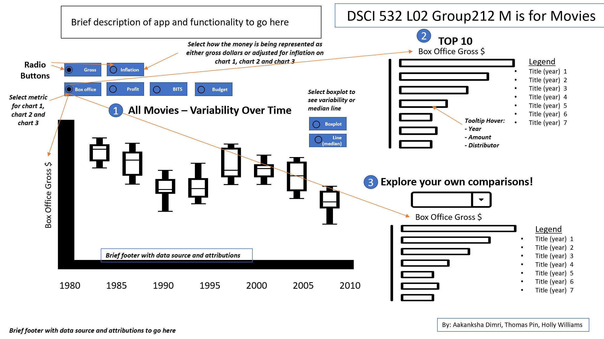

# DSCI_532_L02_Group212_Movies_RDash

Holly Williams, Aakanksha Dimri, and Thomas Pin's DSCI 532 dashboard project on the `movies` dataset. 

## Link to app

LINK()

*Note: link above will be added once app is deployed*

## Description of our app & sketch 

Movie studios will often boast about their high box office numbers, but without a larger picture of the entire industry it can be difficult to gage what these numbers really mean. The success of a film can be determined by looking into outcomes such as profits, butts in seats and box office. These numbers are recorded in databases such as IMDB, but this platform doesn’t allow you to compare films for a more holistic picture of the movie industry and what movies are successful.

This visualization app allows users to explore questions such as whether movies are becoming more expensive to make, whether they’re becoming more profitable now than in the past, and whether audiences are going to the movies more or less frequently than in previous years.

The main feature of this app is that it lets users choose which 'success' metric to explore. They can focus on box office sales, profit, butts in seats, or budget and can choose whether to adjust for inflation or not. The app features a large plot (plot 1 in the figure below) showing data for all movies for the period of record (1980 to 2010). The user can choose whether this plot is a line plot (to get a quick snapshot of average change over time), or a box plot (if they are more interested in variability).  There are also two bar plots on the side. The top chart (plot 2 in the figure below) shows the top 10 films and their values for the selected metric.  The bottom chart (plot 3) has a drop-down menu that lets users explore their own comparisons by selecting movies to compare.

### Functionality

**Overall**:
- Radio buttons will allow users to select a comparison metric that will be used on all plots. Options include:
 - Box office sales 
 - Profit
 - Butts-In-Seats
 - Budget
- A second radio button allows users to select between gross values or values that are adjusted for inflation

**Chart-specific:**
- Plot 1 (all movies) will have a radio button to select whether the data is shown as a box or line chart
- Plot 3 will have drop down menu that will allow users to select as many movies as they like to compare

### Limitations

We are currently thinking that we will only show data for the US as it will be more difficult to aggregate a global "butts-in-seat" metric where currencies and average ticket prices vary country-to-country.

As mentioned in the proposal, we have also excluded:
- movies released before 1980 (due to the presence of erroneous values)
- movies released after 2010 (from lack of information)
- movies in the bottom 5% of `production_budgets`
- movies in the bottom 1% of `US_Gross`

## Links

Links to important files:
 - Heroku App()*Note: link will be added once app is deployed*
 - [App proposal](https://github.com/hwilliams10/DSCI_532_L02_Group212_Movies_RDash/blob/master/proposal.md)
 - [Code of Conduct](https://github.com/hwilliams10/DSCI_532_L02_Group212_Movies_RDash/blob/master/CODE_OF_CONDUCT.md)
 - [Contributing](https://github.com/hwilliams10/DSCI_532_L02_Group212_Movies_RDash/blob/master/CONTRIBUTING.md)
 - [License](https://github.com/hwilliams10/DSCI_532_L02_Group212_Movies_RDash/blob/master/LICENSE.md)
 - [Reflection](https://github.com/hwilliams10/DSCI_532_L02_Group212_Movies_RDash/blob/master/reflection.md)

 This repo contains the following subfolders:
 - `data`: contains all raw data for the dashboard
 - `src`: contains all code files used to wrangle the data, create plots, and make the dashboard
 - `img`: contains saved images and plots

