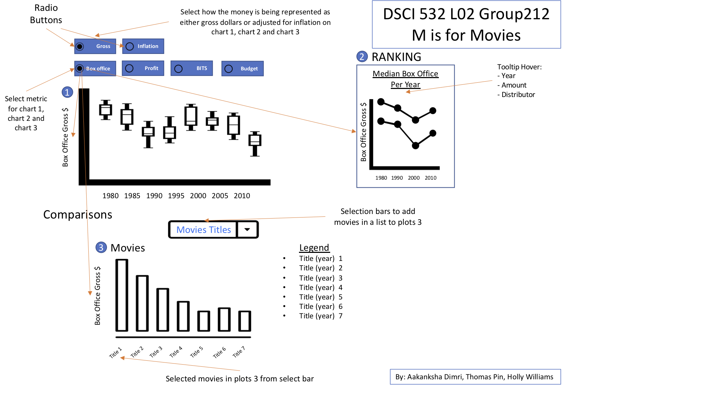
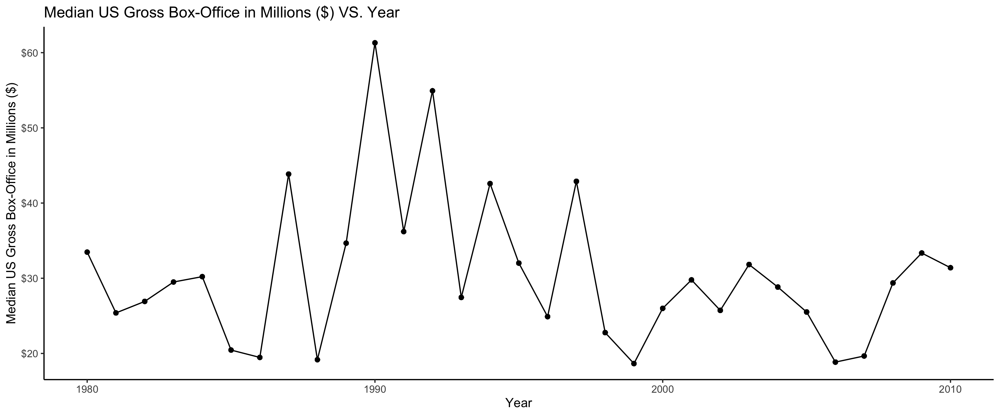
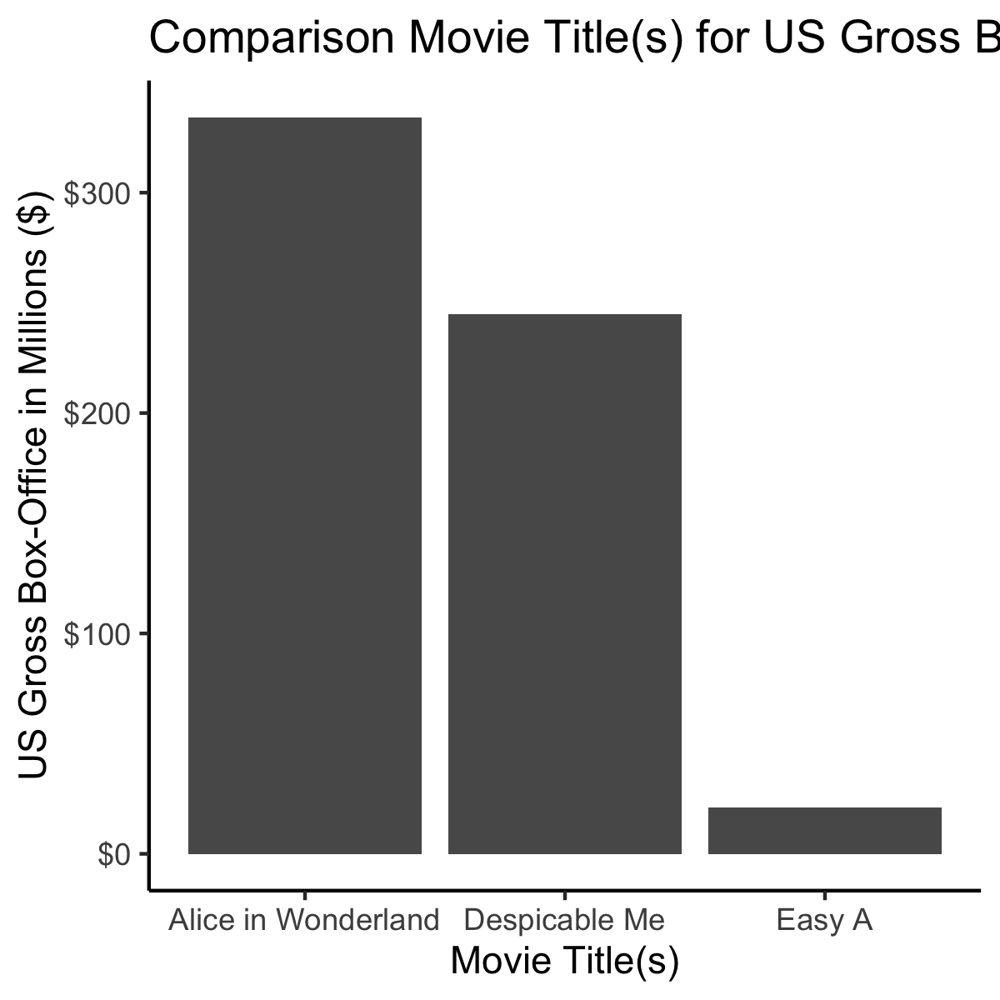

## Sketch

## Plot 1

>Plot 1 Will show a box plot of each of the year in one of the four metrics of box office/profit/bits/budget reported in gross or adjusted for inflation. However, it only shows gross box-office Hover tip needs to be added because most of the fun is looking at the outlier cases. 

## Plot 2

>Plot 2 Will show the median line of one of the four metrics for movies for each year and reported in gross or adjusted for inflation. However, due to time limitation only the default of gross and box-office has been implemented. 

## Plot 3

>Plot 3 Will be a bar chart (potentially swap to another type of chart) that the user can input into search bar above to compare the movies and it will show the metric selected and reporting type from the radio button at the top of the screen above plot 1. A hover tooltip that shows the other metrics should be included to make the analysis tool more robust. The filter list from the search bar functionality is off to a good start and it will not take much more to get it going. 